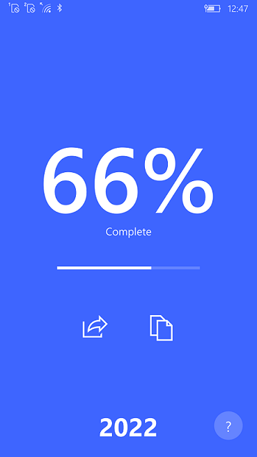

# YearProgressUWP

This is my fork of [YearProgressUWP](https://github.com/colinkiama/YearProgressUWP/) project.

## About

- UWP app that reminds you of where you are in time, the bigger picture, how much of the year has been completed.
- Tells you the current year's progress as a percentage with Live Tiles and Toast Notifications 

## Screenshots

## Tech. details

- YearProgress 2.0.0.0
- Platform: W10M
- Target: ARM
- Recommended os build: 19041
- Minimal supported os. build: 14393

## .

AS IS. No support. RnD only.

## ..

[m][e] 2022